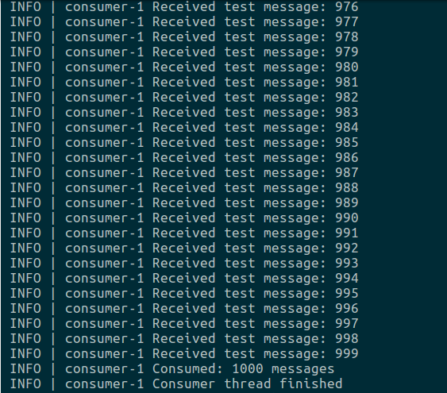

# 前言
工欲善其事，必先利其器。今天是我们学习`ActiveMQ`的第一课，我们就先把我们接下来学习要用到的环境搭建起来。因为我们是基于`Ubuntu 16.04` 和 `C++`来学习，所以我们需要安装的组件包括：Jave、ActiveMQ、ActiveMQ-CPP(用来连接ActiveMQ的C++库)。

# 安装Java环境

1. 去官网下载最新的[JDK](https://www.oracle.com/technetwork/java/javase/downloads/jdk13-downloads-5672538.html)安装包。
2. 解压到喜欢的目录。本人的路径为`/opt/jdk-13.0.1`目录下。
3. 修改`/etc/profile`文件，在该文件最后添加如下几行：
	- export JAVA_HOME=/opt/jdk-13.0.1
	- export CLASS_PATH=.:${JAVA_HOME}/lib
	- export PATH=${JAVA_HOME}/bin:$PATH

4. 在控制台执行`source /etc/profile`使上述配置生效。
5. 紧接着执行`java --version`，若能打印出Java版本信息，则说明配置成功。

# 安装ActiveMQ

1. 去官网下载最新的[安装包](http://activemq.apache.org/components/classic/download/)。
2. 解压到喜欢的目录即可。本人的路径为`/opt/activemq`。

# 安装ActiveMQ-CPP

1. 去官网下载最新的[安装包](http://activemq.apache.org/components/cms/download/)。
2. 解压到喜欢的目录即可。本人的路径为`~/Downloads/activemq-cpp-library-3.9.5`。
3. 进入该目录，执行`./configure --prefix=/opt/activemqcpp`，进行编译配置，并指定要安装到的目录。本人将其安装到`/opt/activemqcpp`。
4. 然后执行`make`，进行编译。
5. 没有错误的话，执行`sudo make install`进行安装即可。
6. 如果编译出错，可能需要安装`APR`，请自行安装后，重新编译即可。

# 测试

1. 启动第一个终端，进入`ActiveMQ`安装目录下的`bin`目录，执行如下命令，即可以前台的形式启动ActiveMQ：
	```shell
	./activemq console
	```
3. 启动第二个终端，同样在`bin`目录执行如下命令，即可启动一个消费者，等待消息到来：
	```shell
	./activemq consumer
	```
4. 启动第三个终端，同样在`bin`目录执行如下命令，即可启动一个生产者，向MQ中生产消息：
	```shell
	./activemq producer
	```
5. 正常情况下，我们会在第二个终端里看到消费者打印消费到的消息，当前版本会总共消费1000条消息后退出：如下图所示：


并且，除了发送默认的消息外，该命令行工具还支持发送我们自定义的消息。命令如下：

```shell
./activemq producer --message "hello_world" --messageCount 10
```

该命令表示：向ActiveMQ中发送10条消息，消息内容是"hello_world"。

其他参数，大家可以执行下面的命令自行查看、测试：

```shell
./activemq consumer --help
```
```shell
./activemq producer --help
```
