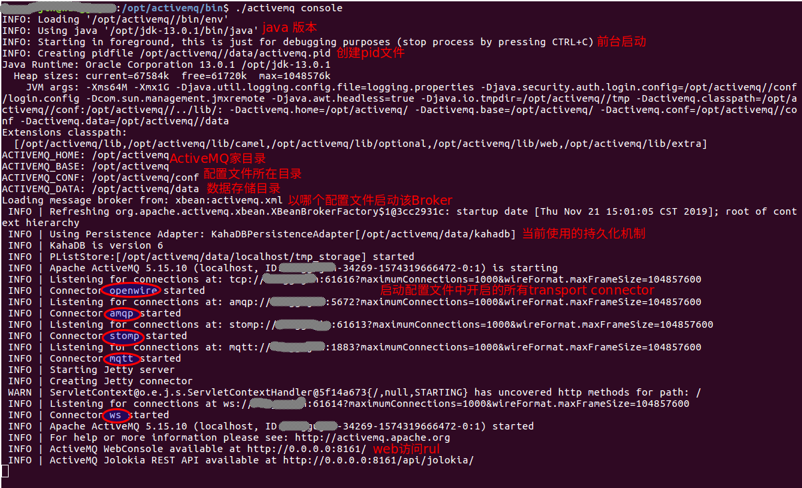
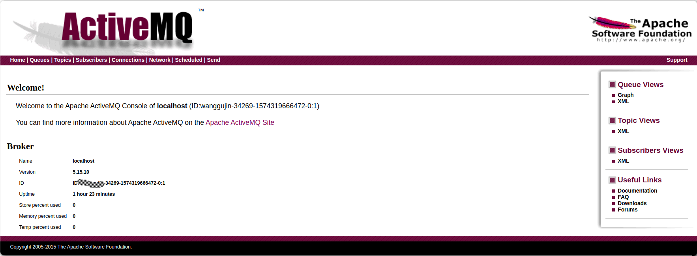
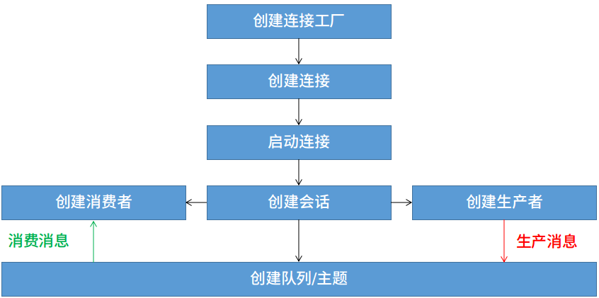
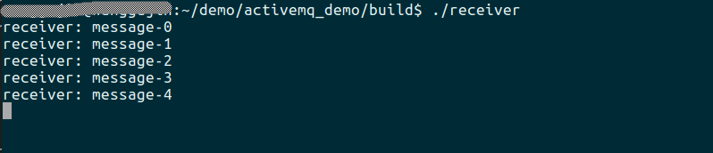
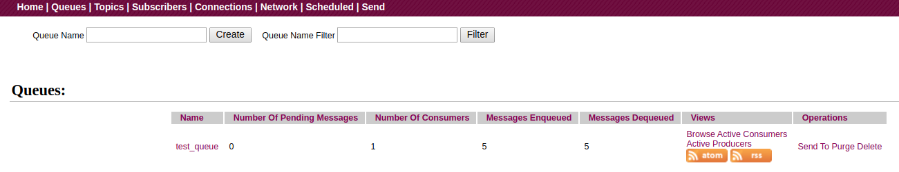

# 开发环境

- Ubuntu 16.04-x64
- GCC-5.4 / CMake 3.13
- jdk 13
- ActiveMQ 5.15
- ActiveMQ-CPP 3.9.5

# 环境安装

- 安装并配置好jdk环境。
- 下载[ActiveMQ安装包](http://activemq.apache.org/components/classic/download/)，然后解压即可。笔者的ActiveMQ目录是/opt/activemq。
- 下载[ActiveMQ-CPP](http://activemq.apache.org/components/cms/download/)，并编译安装到自己喜欢的目录(需要安装 apache apr)。笔者将其安装在/opt/activemqcpp。

# 简介

MQ即Message Queue，翻译为消息队列，也有人称其为消息中间件。主要用于互联网企业，在大型系统中起到解耦、异步、流量削峰的作用。当前主流的消息中间件产品有很多，比如ActiveMQ、RabbitMQ、RocketMQ、Kafka、ZeroMQ等等。

ActiveMQ是Apache下一款成熟的、高性能的消息中间件，其支持多种主流的开发语言，并且全面支持了JMS1.1和J2EE1.4 。主要特性如下：
- 支持多种开发语言：Java/C/C++/Python/Ruby。。。
- 支持多协议:OpenWire/Stomp/MQTT/AMQP。
- 传输模式: 点对点/发布-订阅。
- 支持 消息分组、通配符、虚拟目的地、组合目的地。
- 容易与Spring/SprintBoot集成。
- 支持集群。
- 多种高性能的持久化机制，JDBC、KahaDB、LevelDB。
- 。。。

# 概念

- Broker: 启动的每一个ActiveMQ实例。
- Queue: 队列。
- Topic: 主题。
- Message: 消息。
- transportConnector: 消息传输连接器，用于向Broker发送消息或从Broker消费消息。
- networkConnector: 网络连接器，主要用于搭建master-slave。
- Producer: 消息生产者，负责向消息队列中生产消息。
- Consumer: 消息消费者，负责从消息队列中消费消息。

# 端口

每个Broker会监听两个端口：
- 一个是用于和生产者、消费者建立连接的端口，默认是61616。
- 一个是用于web 控制台，默认是8161。通过该web端，我们可以对ActiveMQ进行监视、管理、测试，也可以直接在该页面上创建队列和主题。

# 启动

打开一个控制台，进入ActiveMQ所在的目录，笔者的是/opt/activemq。我们先简单浏览下整个目录结构，一些主要的目录说明如下：
- bin 所有的可执行文件及脚本所在的目录。
- conf ActiveMQ的配置文件所在的目录。
- data ActiveMQ的日志、数据库(默认是kahadb)所在的目录。
- examples 一些开发样例。
- lib 第三方jar包所在目录。
- activemq-all-5.15.10.jar Java客户端开发所需jar包。

从控制台中，进入bin目录，执行如下命令，即可启动ActiveMQ:
```shell
./activemq start #后台启动
./activemq console #前台启动
```

笔者以前台启动，可在控制台看到启动信息如下：



从打印的启动信息中我们可以了解到如下信息：当前系统的Java版本、MQ的启动方式、该实例的pid文件所在位置、ActiveMQ的家目录、配置文件目录、数据文件目录、当前实例使用的配置文件是哪个、开启的持久化机制是什么、配置的连接器类型有哪些、web控制台的访问路径等等。

本实例中，由于我们是使用安装包中默认的配置文件启动，所以可以看到，该Broker启动了五种协议类型的连接器：OpenWire、amqp、stomp、mqtt、ws。

实际使用中，我们会选择关闭不需要的连接器类型，只保留tcp类型。

# Web 控制台

启动ActiveMQ后，使用浏览器打开http://localhost:8161，即可访问到ActiveMQ的web管理页面。

在页面上点击 Manage ActiveMQ broker，第一次会要求输入用户名/密码，默认为admin/admin。登录后即可看到当前的ActiveMQ状态，比如当前有哪些队列、有哪些主题、有多少消费者在连接、对于主题有多少订阅者。。。



对该页面的简要说明：
- Home 主页面，显示了当前Broker的相关信息。
- Queues 显示当前Broker已有的队列的相关信息。
- Topics 显示当前Broker已有的主题的相关信息。
- Subscribers 显示当前Broker中的主题的订阅者信息。
- Connections 显示当前Broker开启的所有传输连接器的信息。
- Scheduled 显示当前Broker开启的调度器信息，主要用于实现延迟队列，后续文章会进行详细讲解。
- Send 测试向某个队列或主题发送消息。

# 实战

接下来，我们以点对点的队列为例，使用c++开发一个生产者/消费者程序。

1. 首先简单介绍下 ActiveMQ 的访问流程：

初始化ActiveMQ-CPP库->创建连接工厂-> 使用连接工厂创建连接->启动到Broker的连接->使用连接创建会话->使用会话创建队列->使用会话创建生产者/消费者->开始生产/消费消息->释放资源->关闭ActiveMQ-CPP库。

以流程图表示如下：



2. 生产者具体代码实现：
```cpp
#include <iostream>
#include "activemq/core/ActiveMQConnectionFactory.h"
#include "activemq/library/ActiveMQCPP.h"

int main()
{
	activemq::library::ActiveMQCPP::initializeLibrary();
	cms::Connection* connection{nullptr};
	cms::Session* session{nullptr};
	cms::Queue* queue{nullptr};
	cms::MessageProducer* producer{nullptr};
	int num_messages{5};
	std::string broker_url{"tcp://127.0.0.1:61616"};
	std::string queue_name{"test_queue"};
	
	try{
		activemq::core::ActiveMQConnectionFactory acf{broker_url};
		connection = acf.createConnection();
		connection->start();
		
		session = connection->createSession(cms::Session::AUTO_ACKNOWLEDGE);
		queue = session->createQueue(queue_name);
		producer = session->createProducer(queue);
		for(int i{0}; i < num_messages; ++i){
			std::unique_ptr<cms::TextMessage> msg{session->createTextMessage("message-" + std::to_string(i))};
			producer->send(msg.get());
		}
		std::cout << "send done" << std::endl;
		
		if(queue != nullptr){
			delete queue;
			queue = nullptr;
		}
		if(producer != nullptr){
			delete producer;
			producer = nullptr;
		}
		if(session != nullptr){
			session->close();
			delete session;
			session = nullptr;
		}
		if(connection != nullptr){
			connection->close();
			delete connection;
			connection = nullptr;
		}
	}catch(cms::CMSException& e){
		e.printStackTrace();
	}
	
	activemq::library::ActiveMQCPP::shutdownLibrary();
	
	return 0;
}
```
此处我们创建了一个名为`test_queue`的消息队列，然后以自动确认的机制向该队列发送了5条TextMessage消息。有关消息队列的确认和事物机制，后序文章会详细讲解。

3. 消费者具体代码实现：
```cpp
#include <iostream>
#include "activemq/core/ActiveMQConnectionFactory.h"
#include "activemq/library/ActiveMQCPP.h"

int main()
{
	activemq::library::ActiveMQCPP::initializeLibrary();
	
	cms::Connection* connection{nullptr};
	cms::Session* session{nullptr};
	cms::Queue* queue{nullptr};
	cms::MessageConsumer* consumer{nullptr};
	std::string broker_url{"tcp://127.0.0.1:61616"};
	std::string queue_name{"test_queue"};
	
	try{
		activemq::core::ActiveMQConnectionFactory acf{broker_url};
		connection = acf.createConnection();
		connection->start();
		session = connection->createSession(cms::Session::AUTO_ACKNOWLEDGE);
		queue = session->createQueue(queue_name);
		consumer = session->createConsumer(queue);
		while(true){
			cms::Message* msg{consumer->receive()};
			cms::TextMessage* text_msg{dynamic_cast<cms::TextMessage*>(msg)};
			if(text_msg != nullptr){
				std::cout << "receiver: " << text_msg->getText() << std::endl;
			}else{
				std::cout << "not a text message" << std::endl;
			}
			delete msg;
		}
		
		if(queue != nullptr){
			delete queue;
			queue = nullptr;
		}
		if(consumer != nullptr){
			delete consumer;
			consumer = nullptr;
		}
		if(session != nullptr){
			session->close();
			delete session;
			session = nullptr;
		}
		if(connection != nullptr){
			connection->close();
			delete connection;
			connection = nullptr;
		}
	}catch(cms::CMSException& e){
		e.printStackTrace();
	}
	
	activemq::library::ActiveMQCPP::shutdownLibrary();
	
	return 0;
}
```
此处我们仍然以自动确认的方式连接到ActiveMQ，然后循环的调用消费者的`receive()`方法，从队列中消费消息。

3. 编写CMakeLists
- 顶层 CMakeLists.txt 如下：

```cmake
cmake_minimum_required(VERSION 2.8)
project(activemq_demo)

add_definitions(-std=c++11)
add_definitions("-Wall -g")

include_directories(
	/opt/activemqcpp/include
	/usr/local/include/apr-1
)

link_directories(
	/opt/activemqcpp/lib
)

add_subdirectory(demo1)
```
- demo1的 CMakeLists.txt 如下：
```cmake
set(EXECUTABLE_OUTPUT_PATH ${PROJECT_BINARY_DIR})
add_executable(sender sender.cpp)
add_executable(receiver receiver.cpp)
target_link_libraries(sender activemq-cpp)
target_link_libraries(receiver activemq-cpp)
```

4. 编译

在`activemq_demo`目录下执行`bash build.sh`，将在build目录下生成`sender/receiver`两个可执行程序。

5. 运行

保证ActiveMQ当前处于运行状态，然后在控制台上先运行`sender`。执行后，观察ActiveMQ的web终端，选择`Queues`标签页，若看到如下信息，则说明消息生产成功：


此页面状态说明，当前`test_queue`中入队了5条消息(Enqueued)，当前有5条消息待消费(Pending)，当前有0个消费者在线(Consumers)，当前有0个消息已出队(Dequeued)。

接下来，我们启动消费者，如果终端能打印出消息，说明消费消息成功：



说明我们成功消费到了队列中的消息。此时我们在观察一下web终端，会看到如下信息：



此状态说明：当前有0条消息待消费，因为我们刚才消费了所有的消息；有1个消费者在线，因为从终端上来看，我们消费了5条消息后，消费者并没有退出，原因下文会解释；有5条消息入队；有5条消息已出队。

至此，说明我们ActiveMQ的生产者/消费者程序已完全跑通。

# 补充

1. 上述代码中，创建连接工厂时，我们是定义了一个 `activemq::core::ActiveMQConnectionFactory` 对象，然后使用该对象来创建到ActiveMQ的连接。其实，通过跟踪`ActiveMQ-CPP`的源码可以发现，`activemq::core::ActiveMQConnectionFactory` 继承自 `cms::ConnectionFactory`，而该类有一个静态方法`static cms::ConnectionFactory* createCMSConnectionFactory(const std::string& brokerURI)`，所以，我们也可以使用该函数来创建我们的连接工厂，代码如下：
```cpp
//activemq::core::ActiveMQConnectionFactory acf{broker_url};
cms::ConnectionFactory* cf{cms::ConnectionFactory::createCMSConnectionFactory(broker_url)};
connection = cf->createConnection();
delete cf;
cf = nullptr;
```

2. 关于消费者端的`receive()`方法

上述代码中，我们调用的是无参的`receive()`，该函数在没有消息到来时，会一直阻塞等待，所以我们的消费者在消费了5条消息后，并没有退出。

如果希望消费者在等待一定时间后，仍没有消息到来，就退出整个程序，我们可以调用该函数的重载版本`receive(int millisecs)`，为其传入一个我们希望等待的时长，如果在该时长内没有消息到来，该函数会返回`nullptr`，通过判断返回值，我们就可以控制程序的退出了。

除此之外，我们还可以调用另一个函数`receiveNoWait()`，该函数在没有消息到来时并不等待，而是立即返回`nullptr`。

3. 最后要注意的是，无论生产者还是消费者，都有手动释放创建的消息或接收到的消息，以免内存泄露。

4. 其实，不论调用哪个上述哪个函数，本质上都是消费者主动接收或者轮训ActiveMQ，目前有没有消息可用。为了解决这个问题，我们可用使用另外两种方法：
	- 将消费者逻辑放到单独的线程中去做。
	- 为消费者设置一个消息监听器，当有消息到来时，自动回调我们设置的监听器方法。

我会在下一篇文章里演示这两种方式的实现方法。

5. 本文完整代码见[demo1](https://github.com/wanggujin/LearnActiveMQ/tree/master/lesson1)