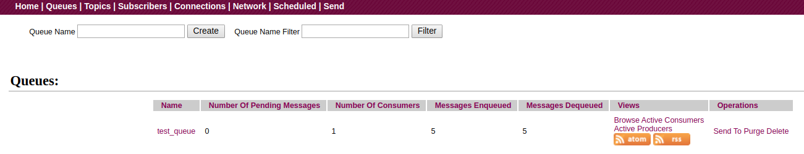

# 前言

前面两篇文章，我们学习了`ActiveMQ`的环境安装、基本概念。在介绍`ActiveMQ`的特性时，我们提过，`ActiveMQ`目前主要有两种使用方式，一种是基于`队列`的点对点，一种是基于`主题`的发布-订阅。今天，我们就先以`队列`为例，使用`ActiveMQ-CPP`库来开发一个生产者/消费者程序，也以此来学习一下怎么向队列发送和消费消息。以及同步消费和异步消费的区别。

# 流程

使用`ActiveMQ-CPP`来访问`ActiveMQ`的一般流程如下：

初始化ActiveMQ-CPP库->创建连接工厂-> 使用连接工厂创建连接->启动到Broker的连接->使用连接创建会话->使用会话创建队列->使用会话创建生产者/消费者->开始生产/消费消息->释放资源->关闭ActiveMQ-CPP库。

以流程图表示如下：


# 实战

废话不多说，我们直接按照上面的流程来写代码。

## 生成者端的核心代码如下

```cpp
activemq::library::ActiveMQCPP::initializeLibrary(); //1
cms::Connection* connection{nullptr};
cms::Session* session{nullptr};
cms::Queue* queue{nullptr};
cms::MessageProducer* producer{nullptr};
int num_messages{5}; //2
std::string broker_url{"tcp://127.0.0.1:61616"}; //3
std::string queue_name{"test_queue"}; //4

try{
	activemq::core::ActiveMQConnectionFactory acf{broker_url}; //5
	connection = acf.createConnection(); //6
	connection->start(); //7
	
	session = connection->createSession(cms::Session::AUTO_ACKNOWLEDGE); //8
	queue = session->createQueue(queue_name); //9
	producer = session->createProducer(queue); //10
	for(int i{0}; i < num_messages; ++i){
		std::unique_ptr<cms::TextMessage> msg{session->createTextMessage("message-" + std::to_string(i))};
		producer->send(msg.get()); //11
	}
	std::cout << "send done" << std::endl;
	
	if(queue != nullptr){ //12
		delete queue;
		queue = nullptr;
	}
	if(producer != nullptr){
		delete producer;
		producer = nullptr;
	}
	if(session != nullptr){
		session->close();
		delete session;
		session = nullptr;
	}
	if(connection != nullptr){
		connection->close();
		delete connection;
		connection = nullptr;
	}
}catch(cms::CMSException& e){
	e.printStackTrace();
}

activemq::library::ActiveMQCPP::shutdownLibrary(); //13
```

关键代码说明如下：

1. 初始化`ActiveMQ-CPP`库。
2. 定义我们想要发送的消息数量。
3. Broker的URL，即`ActiveMQ`监听的URL。
4. 定义我们的队列名称。
5. 实例化连接工厂。
6. 使用连接工厂创建到MQ的连接。
7. 启动该连接。
8. 使用连接对象，创建到`ActiveMQ`的会话，使用自动确认机制（后面的文章会讲到确认机制）。
9. 使用会话对象创建我们的目的地，即队列。
10. 使用会话对象创建生产者对象。
11. 向队列中发送文本消息。
12. 释放相关资源。
13. 关闭`ActiveMQ-CPP`库，释放资源。

## 消费者端的核心代码如下

```cpp
activemq::library::ActiveMQCPP::initializeLibrary();
cms::Connection* connection{nullptr};
cms::Session* session{nullptr};
cms::Queue* queue{nullptr};
cms::MessageConsumer* consumer{nullptr};
std::string broker_url{"tcp://127.0.0.1:61616"};
std::string queue_name{"test_queue"};

try{
	activemq::core::ActiveMQConnectionFactory acf{broker_url};
	connection = acf.createConnection();
	connection->start();
	session = connection->createSession(cms::Session::AUTO_ACKNOWLEDGE);
	queue = session->createQueue(queue_name);
	consumer = session->createConsumer(queue);
	while(true){
		cms::Message* message{consumer->receive()};
		if(message != nullptr){
			cms::TextMessage* msg{dynamic_cast<cms::TextMessage*>(msg)};
			if(msg != nullptr){
				std::cout << "receiver: " << msg->getText() << std::endl;
			}else{
				std::cout << "not a text message" << std::endl;
			}
			delete message;
		}else{
			break;
		}
	}
	
	if(queue != nullptr){
		delete queue;
		queue = nullptr;
	}
	if(consumer != nullptr){
		delete consumer;
		consumer = nullptr;
	}
	if(session != nullptr){
		session->close();
		delete session;
		session = nullptr;
	}
	if(connection != nullptr){
		connection->close();
		delete connection;
		connection = nullptr;
	}
}catch(cms::CMSException& e){
	e.printStackTrace();
}

activemq::library::ActiveMQCPP::shutdownLibrary();
```

编译上述代码后，会在`build`目录生成`sender` 和 `receiver`程序。

## 测试

1. 启动第一个终端，进入`ActiveMQ`的安装目录，先启动我们的消息队列。笔者的目录为`/opt/activemq/bin`：
```shell
./activemq console # 前台启动
```
2. 启动第二个终端，进入`build`目录，启动我们的生产者，向队列中生成消息：
```shell
./sender
```
如果成功运行，我们会在终端看到打印的`send done`。同时，我们可以进入`ActiveMQ`的web控制台`http://localhost:8161`页面，选择`Queues`标签页，可看到如下信息：


对此页面说明如下：

- `Name` 队列名称。
- `Number of Pending Messages` 当前队列中待消费的消息数量。
- `Number of Consumers` 当前在线的消费者数量。
- `Messages of Enqueued` 进入队列的消息总数。
- `Messages of Dequeued` 已出队的消息总数。

由此页面可见，我们成功的将5条消费发到了`test_queue`队列。

3. 启动第三终端，进入`build`目录，启动我们的消费者，开始消费队列中的消息：
```shell
./receiver
```
如果成功运行，我们会在终端看到如下结果：


说明我们成功消费到了刚才发送的消息。

我们也可以再次看一个web终端，结果如下：



该页面显示，当前待消费的消息数量为0，因为我们成功消费到了全部的消息；在线的消费者数量为1，因为我们的`receiver`并没有退出；已出队消息数为5，因为队列中的5条消息已都被我们消费。

## 关于连接工厂

上述代码中，我们在创建连接工厂时，是直接定义一个`ActiveMQConnectionFactory`的对象。而`ActiveMQConnectionFactory`继承自`ConnectionFactory`，所以，我们还可以使用另一种方式来创建连接工厂。代码如下：
```cpp
std::unique_ptr<cms::ConnectionFactory> cf{cms::ConnectionFactory::createCMSConnectionFactory(broker_url)};
connection = cf->createConnection();
cf.reset();
```

## 关于消息接收

上面运行`receiver`时，我们说到，当队列中的5条消息都消费完后，我们的`receiver`并没有退出，这是因为我们在代码中调用的接收方法是`receive()`。该函数在没有消息到来时，会一直阻塞等待，所以，我们的消费者进程并没有退出。当然，除了`receive()`，我们还可以调用`receive(int)`，为此函数传递一个毫秒值，当没有消息到来时，该函数会在指定时间后返回空值。这样，我们可以根据`receive(int)`的返回值，控制消费者的退出与否。

如果你说，想在没有消息时，立马返回或退出，那我们可以调用另一个方法`receiveNoWait()`，该函数在没有消息到来时，会立刻返回空值。

## 消息监听器之 `MessageListener`

其实，上面提到的几个接收方法，都属于同步等待接收。除此之外，`ActiveMQ-CPP`还支持被动接收，即为我们的消费者设置一个消息监听器。这样，当有消息到来时，会自动调用我们设定的回调函数，我们可以在此函数中处理我们接收到的最新的消息。核心代码如下：
```cpp
class MyMessageListener : public cms::MessageListener{
public:
	void onMessage(const cms::Message* message){
		if(message != nullptr){
			cms::TextMessage const* msg{dynamic_cast<const cms::TextMessage*>(message)};
			if(msg != nullptr){
				std::cout << "callback receiver: " << msg->getText() << std::endl;
			}else{
				std::cout << "not text message" << std::endl;
			}
		}else{
			std::cout << "message is null" << std::endl;
		}
	}
};

int main(){
	MyMessageListener message_listener;
	consumer->setMessageListener(&message_listener);
	decaf::lang::Thread::sleep(1000 * 10);
}
```

先通过继承`cms::MessageListener`实现我们自己的消息监听器。然后实例化一个该监听器，并将该消息监听器设置到我们的消费者对象上。注意，因为当前是主线程，一定要休眠一段时间等待消息的到来，免得`main`函数在消息到来之前退出。

## 消息监听器之 `MessageAvailableListener`

除了上面提到的`MessageListener`，`ActiveMQ-CPP` 库中还有另一种消息监听器，即`MessageAvailableListener`。这种监听器，它只是告诉我们当前有消息可以消费而不会阻塞我们的`receive()`方法，但它本身并不替我们消费消息，即需要我们在回调函数中自己调用`receive()` 去接收消息。只是，此时我们可以确定，该`receive()`不会阻塞，一定能消费到一条消息。使用方式如下：
```cpp
class MyMessageAvailableListener : public cms::MessageAvailableListener{
public:
	void onMessageAvailable(cms::MessageConsumer* consumer){
		cms::Message* message{consumer->receive()};
		if(message != nullptr){
			cms::TextMessage const* msg{dynamic_cast<const cms::TextMessage*>(message)};
			if(msg != nullptr){
				std::cout << "receiver will not block: " << msg->getText() << std::endl;
			}else{
				std::cout << "not text message" << std::endl;
			}
		}else{
			std::cout << "message is null" << std::endl;
		}
	}
};

int main(){
	MyMessageAvailableListener message_listener;
	consumer->setMessageListener(&message_listener);
	decaf::lang::Thread::sleep(1000 * 10);
}
```
对于消费者对象的设置同上。至于运行效果，大家可以自行测试。

本文详细代码见[lesson1](https://github.com/wanggujin/LearnActiveMQ/tree/master/lesson1)