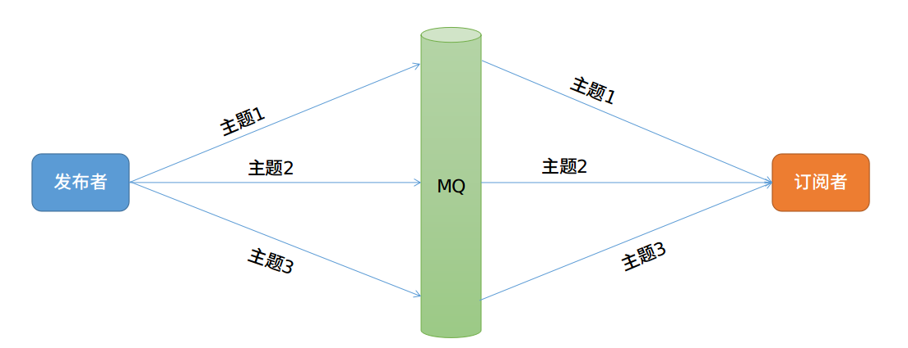
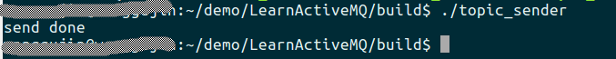
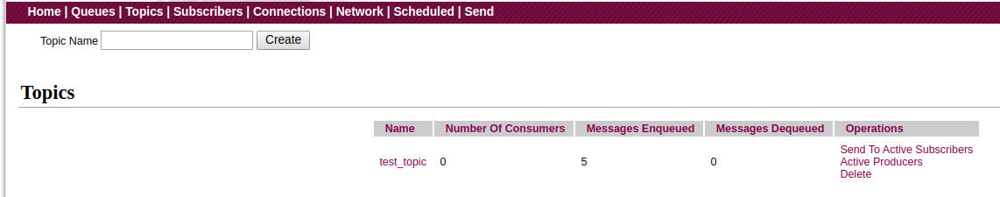
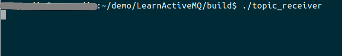
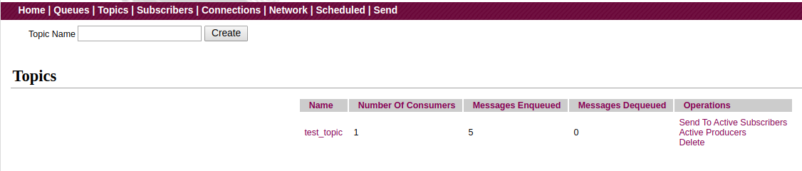
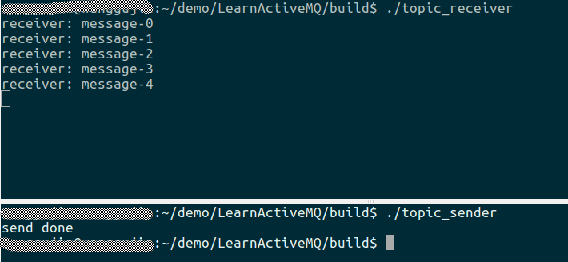
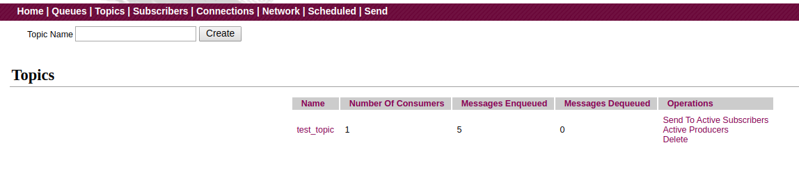
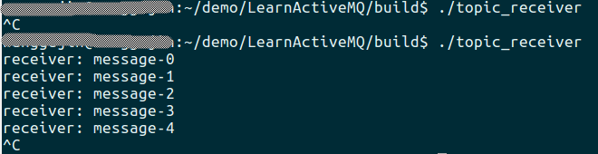
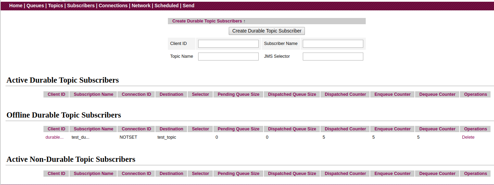

# 前言

在第一篇文章中，我们对ActiveMQ的基本介绍中就提到过，目前ActiveMQ主要有两种使用模式，一种是点对点，一种是发布订阅。而前面两篇文章中，我们使用的Queue就属于点对点模式。所以，今天我们就来学习另一个使用模式：发布-订阅。

# 主题

所谓发布-订阅，顾名思义，其中牵涉到两种角色：发布者(Publisher)和订阅者(subscriber)。他们通过"主题"进行交互。发布者向ActiveMQ中的某个主题发布消息，订阅者在订阅了某个主题后，等待消息的到来。一个发布者可以同时发布多种消息，同样，一个订阅者可以同时订阅多个主题，甚至可以让多个订阅者订阅同一个主题，类似于很多人关注了同一个微信公众号。这样，当发布者在该主题上发布了一条消息，所有订阅了该主题的订阅者都能收到该消息。简单图示如下：



# 实战

废话不多说，我们直接实操代码来演示基本的发布-订阅模式。发布者(生产者)端的核心代码如下：

```cpp
activemq::core::ActiveMQConnectionFactory acf{broker_url};
connection = acf.createConnection();
connection->start();

session = connection->createSession(cms::Session::AUTO_ACKNOWLEDGE);
topic = session->createTopic(topic_name);
producer = session->createProducer(topic);
for(int i{0}; i < num_messages; ++i){
	std::unique_ptr<cms::TextMessage> msg{session->createTextMessage("message-" + std::to_string(i))};
	producer->send(msg.get());
}
std::cout << "send done" << std::endl;
```

订阅者(消费者)端的核心代码如下：

```cpp
activemq::core::ActiveMQConnectionFactory acf{broker_url}; 
connection = acf.createConnection();
connection->start();

session = connection->createSession(cms::Session::AUTO_ACKNOWLEDGE);
topic = session->createTopic(topic_name);
consumer = session->createConsumer(topic);
while(true){
	cms::Message* message{consumer->receive()};
	if(message != nullptr){
		cms::TextMessage* msg{dynamic_cast<cms::TextMessage*>(message)};
		if(msg != nullptr){
			std::cout << "receiver: " << msg->getText() << std::endl;
		}else{
			std::cout << "not a text message" << std::endl;
		}
	}else{
		break;
	}
	delete message;
}
```

编译后，会在`build`目录生成`topic_sender`和`topic_receiver`可执行程序。

接下来，我们运行`topic_sender`，向`test_topic`主题发布几条消息。执行后，结果如下：





可见，我们成功的将5条消息发布到了ActiveMQ中的`test_topic`主题下。

紧接着，我们启动`topic_receiver`程序，运行结果如下：





意外的是，我们的接收端并没有收到发布者所发布的消息，并且web端也显示了我们的订阅者当前是成功的连接到了ActiveMQ。

这里的原因就是，对于主题消息来说，如果该主题当前没有订阅者在线或没有订阅该主题的持久订阅者，那么，发布者发布的消息就会成为一条废消息，不会推送给后续的任何订阅者。官网的说明如下：

> When you publish a message it goes to all the subscribers who are interested - so zero to many subscribers will receive a copy of the message. <font color='red'>Only subscribers who had an active subscription at the time the broker receives the message will get a copy of the message.</font>

所以，此处，如果我们想看到正常的现象，最简单的修改方式就是先启动我们的`topic_receiver`，对主题进行订阅，等待消息的到来；然后，再启动`topic_sender`发布消息即可。运行结果如下：



总于，我们看到接收端成功收到了发布者在该主题上发布的消息。

# 持久订阅

还有一个问题是，如果订阅者在订阅后接收到一些消息，然后宕机了。那么，当该订阅者重启后，是否能收到其宕机期间发布者发布的消息呢。我们来试试。

根据上图，现在我们的订阅者`topic_receiver`还在连接着ActiveMQ，如果此时再次运行一下`topic_sender`，其发布的消息, `topic_receiver`仍然可以收到，大家可以自行测试。问题是，如果我们先关闭`topic_receiver`，然后运行一次`topic_sender`，先该主题发布几条消息，再启动我们的`topic_receiver`，看是否能接收到我们刚才发布的消息。运行结果如下：


可以看到，我们并没有收到刚才发布者发布的消息。这就就好比，你关注了一个微信公众号后，可以接收到作者推送的文章，但如果你取关了几天后再次关注该公众号，那么，你肯定不会收到在你取关这几天内作者发布的文章。此处，道理类似。

那如果，我就是想在重新订阅主题后，希望ActiveMQ向我推送我宕机期间发布者发布的消息，该怎么实现呢？为此，ActiveMQ为我们提供了`持久订阅`功能。

对于一个持久订阅者来说，当发布者发布消息时，如果其在线，那么他会正常收到消息；如果此时其不在线，那么ActiveMQ会为其保留在此期间所有的消息，当该持久订阅者再次上线时，将这些消息依次推送给他。

那么，怎么创建一个持久订阅呢？其实，只需将上文订阅者端的代码进行两处修改即可。
- 在`connection->start()`之前为我们的连接设置一个唯一ID，如`connection->setClientID("durable_client");`
- 调用`createDurableConsumer()`来创建订阅者，其声明如下：

```cpp
virtual MessageConsumer* createDurableConsumer(const Topic* destination, const std::string& name, const std::string& selector, bool noLocal = false) = 0;
```

- `destination`，即为我们要订阅的Topic。
- `name`，需要我们给ActiveMQ传递一个唯一标识我们身份的字符串。
- `selector`，消息选择器，可以让我们只选择接收我们感兴趣的特定格式的消息。
- `noLocal`，是否禁止接收自己发出的消息，保持默认即可。

修改完毕，重新编译程序即可。

为了演示方便，我们直接重启一次ActiveMQ, 然后先启动我们的新编译出的`topic_receiver_durable`， 对主题进行持久订阅，然后退出。

紧接着，我们运行一次`topic_sender`向主题发布几条消息。运行结果如下：



可见，我们仍然是成功向主题发布了5条消息。并且，上图和之前不一样的是，由于我们发布之前运行过订阅者，对该主题进行了持久订阅，虽然，此时，我们的`topic_receiver`并不在线，但队列的消费者个数依然显示为1，也即证明了ActiveMQ为我们保存了刚才那个持久订阅者。然后，我们再次启动我们的`topic_receiver`，我们就能收到刚才发布的5条消息，而这5条消息，是订阅者不在线的时候，由发布者发布出来的。也即证明了我们上面所述之理论。`topic_receiver`运行如下：



另外，在第一篇文章中，我们介绍了ActiveMQ的web管理页面。在那里也可以看到当前Broker中的所有主题信息以及订阅者的信息。其中订阅者信息界面如下：



从上图我们也可以看到，ActiveMQ对订阅者的分类：活动的持久订阅者、离线的持久订阅者、活动的非持久订阅者。当前在`离线的持久订阅者`表格中，即显示了我们刚才创建的持久化订阅者。

本文详细代码见[lesson3](https://github.com/wanggujin/LearnActiveMQ/tree/master/lesson3)
