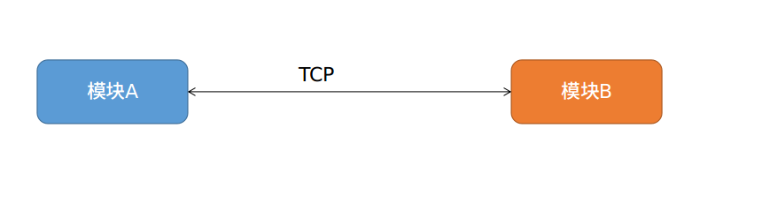
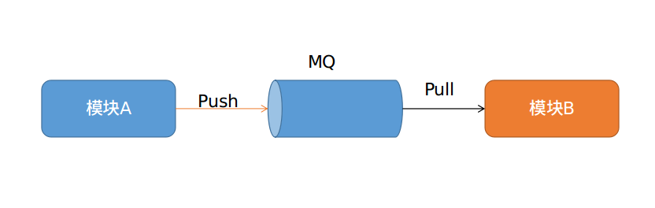

# 前言

在上一篇文章中，我们一起搭建了基于`Ubuntu 16.04` 和 `C++`的开发环境，并使用ActiveMQ自带的命令行工具进行了环境测试。本篇文章，我们一起来了解下`ActiveMQ`以及其中常用的概念介绍。

# 简介

`MQ` 即Message Queue，翻译为消息队列，也有人称其为消息中间件。主要用于互联网企业，在大型系统中起到解耦、异步、流量削峰的作用。当前主流的消息中间件产品有很多，比如ActiveMQ、RabbitMQ、RocketMQ、Kafka、ZeroMQ等等。

`ActiveMQ`是Apache旗下一款成熟的、高性能的消息中间件，其支持多种主流的开发语言，并且全面支持了JMS1.1和J2EE1.4 。主要特性如下：
- 支持多种开发语言：Java/C/C++/Python/Ruby。。。
- 支持多协议:OpenWire/Stomp/MQTT/AMQP。
- 传输模式: 点对点/发布-订阅。
- 支持 消息分组、通配符、虚拟目的地、组合目的地。
- 容易与Spring/SprintBoot集成。
- 支持集群。
- 多种高性能的持久化机制，JDBC、KahaDB、LevelDB。
- 。。。

# 常用概念

- Broker: 启动的每一个ActiveMQ实例。
- Queue: 队列。
- Topic: 主题。
- Message: 消息。
- transportConnector: 消息传输连接器，用于向Broker发送消息或从Broker消费消息。
- networkConnector: 网络连接器，用于连接不同的Broker。
- Producer: 消息生产者，负责向消息队列中生产消息。
- Consumer: 消息消费者，负责从消息队列中消费消息。

# 端口

每个Broker会监听两个端口：
- 一个是用于和生产者、消费者建立连接的端口，默认是61616。
- 一个是用于web 控制台，默认是8161。通过该web端，我们可以对ActiveMQ进行监视、管理、测试，也可以直接在该页面上创建队列和主题。

# 启动

打开一个控制台，进入ActiveMQ所在的目录，笔者的是/opt/activemq。我们先简单浏览下整个目录结构：

- bin 所有的可执行文件及脚本所在的目录。
- conf ActiveMQ的配置文件所在的目录。
- data ActiveMQ的日志、数据库(默认是kahadb)所在的目录。
- examples 一些开发样例。
- lib 第三方jar包所在目录。
- activemq-all-5.15.10.jar Java客户端开发所需jar包。

从控制台中，进入bin目录，执行如下命令，即可启动和停止ActiveMQ:

```shell
./activemq start #后台启动
./activemq console #前台启动
./activemq stop #停止
```

笔者以前台启动，可在控制台看到启动信息如下：


从打印的启动信息中我们可以了解到如下信息：当前系统的Java版本、MQ的启动方式、该实例的pid文件所在位置、ActiveMQ的家目录、配置文件目录、数据文件目录、当前实例使用的配置文件是哪个、开启的持久化机制是什么、配置的连接器类型有哪些、web控制台的访问路径等等。

本实例中，由于我们是使用安装包中默认的配置文件启动，所以可以看到，该Broker启动了五种协议类型的连接器：OpenWire、amqp、stomp、mqtt、ws。

实际使用中，我们会选择关闭不需要的连接器类型，只保留实际需要的类型。

# Web 控制台

启动ActiveMQ后，使用浏览器打开http://localhost:8161，即可访问到ActiveMQ的web管理页面。

在页面上点击 `Manage ActiveMQ broker`，按要求输入用户名/密码，默认为admin/admin。登录后即可看到当前的ActiveMQ状态，比如当前有哪些队列、有哪些主题、有多少消费者在连接、对于主题有多少订阅者。。。


对该页面的简要说明：
- Home 主页面，显示了当前Broker的相关信息。
- Queues 显示当前Broker已有的队列的相关信息。
- Topics 显示当前Broker已有的主题的相关信息。
- Subscribers 显示当前Broker中的主题的订阅者信息。
- Connections 显示当前Broker开启的所有传输连接器的信息。
- Scheduled 显示当前Broker开启的调度器信息，主要用于实现延迟队列，后续文章会进行详细讲解。
- Send 测试向某个队列或主题发送消息。

# 使用消息队列的好处

## 模块解耦

即让一个系统中的各模块间不要有那么强的关联性，一个模块的宕机不要影响到其他模块。



如上图，传统模式下，我们的系统中各个模块都是直接通过HTTP/TCP进行关联的，这样的话，任何一个模块的宕机都会导致另一个或多个模块无法对外提供服务，因为他们之间是强依赖关系。

而如果我们在模块之间引入MQ后，就可以解除这种依赖，如下图：



这种情况下，模块A只需将数据推送到中间的MQ即可，至于模块B当前是不是在运行、什么时候取走这条数据，模块A并不需要关心。由此可见，这种架构下，任何一个模块的宕机均不会影响到其他模块的正常运行。

## 流量削峰

假设对于一个支付系统来说，平时的订单请求只有100笔/秒，系统可以正常运行。而在做活动期间的订单请求可以到达10000笔/秒，这突然的流量陡增，就有可能导致系统或数据库宕机。当然，最直接的方式就是对整个系统扩容，部署更多的机器对外服务。但这样就会因为少量的活动而大大增加公司开销。

这种情况下，我们就可以通过为系统引入一个MQ来解决这种流量陡增的问题。即客户的订单请求不要直接打到后端服务器，而是放在消息队列中排队，后端系统再从消息队列中逐条拉去订单数据，进行处理。这样一来，如果是正常交易期间的100笔/秒，由于我们的后端系统能及时处理这100笔订单，那么消息队列中不会出现消息挤压；而如果是活动期间，由订单量大大超出系统的处理能力，这样大量的订单会在消息队列中排队，但不会影响后端系统的运行，从而以很低的成本平滑了系统流量冲击。

## 数据分发

这个就很好理解了。还是以订单来说，如果用户成功向支付系统进行了支付，那么该支付系统就需要将该条订单数据交给邮件系统、短息系统、发货系统等等，向用户发送下单成功的邮件通知、下单成功的短信通知，并进行发货。这时，会了系统解耦和降低通信时延，支付系统可以简单的将该条订单数据放到一个特定的消息队列即可，需要订单数据的其他系统可以监听这个消息队列，一旦有数据进入队列，它们消费到进行处理即可。

# 使用消息队列的坏处

那么，除了上面说的消息队列的好处，它有没有坏处呢？其实，最显而易见的一点，我想大多数人都能想到，那就是不同的系统模块之间通过消息队列进行交互，那如果消息队列本身宕机了怎么办。确实是有这个问题，所以实际项目上，我们都会把消息队列也部署为集群模式，来降低这个环节的风险。

其实，还有另一个问题，就是数据一致性的问题。以前，我们的系统之间都是直接同步通信，一步一步的交互，某一步失败了，直接返回即可。而现在，引入消息队列后，系统间的交互变长了异步了，那么如果三个操作中的两个成功一个失败了，这时该怎么处理呢，怎么让数据回滚到最初的一致性状态呢？这也是实际项目上比较常见的问题。