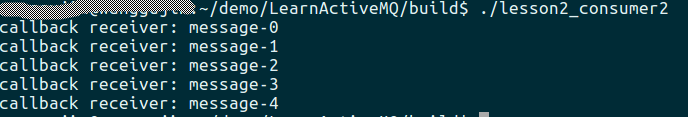
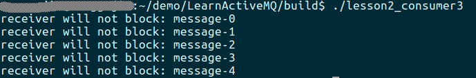

# 前言

上一篇文章中，我们学习了ActiveMQ的基本概念，并使用ActiveMQ-CPP基于Queue模式完成了一个简单的生产者/消费者程序。但在那个程序里，我们消费者调用的是`receive()`方法，该方法在没有消息到来时，会一直阻塞等待。如果是单线程程序，进而会阻塞整个进程，那我们就没办法进行其他的业务逻辑的处理了。我们可以使用如下几种方法来解决这个问题:

## 方法一

为了解决这个问题，最容易想到的方法肯定是将对消息的消费逻辑放到单独的线程里，当成功消费到消息时进行处理或者通过线程间通信机制让其他线程来处理。事例代码如下：
```cpp
#include <iostream>
#include <thread>
#include "activemq/core/ActiveMQConnectionFactory.h"
#include "activemq/library/ActiveMQCPP.h"

void ConsumerThread(){
	cms::Connection* connection{nullptr};
	cms::Session* session{nullptr};
	cms::Queue* queue{nullptr};
	cms::MessageConsumer* consumer{nullptr};
	std::string broker_url{"tcp://127.0.0.1:61616"};
	std::string queue_name{"test_queue"};
	
	try{
		cms::ConnectionFactory* cf{cms::ConnectionFactory::createCMSConnectionFactory(broker_url)};
		connection = cf->createConnection();
		delete cf;
		cf = nullptr;
		
		connection->start();
		session = connection->createSession(cms::Session::AUTO_ACKNOWLEDGE);
		queue = session->createQueue(queue_name);
		consumer = session->createConsumer(queue);
		
		while(true){
			cms::Message* message{consumer->receive(5000)};
			if(message != nullptr){
				cms::TextMessage* msg{dynamic_cast<cms::TextMessage*>(message)};
				if(msg != nullptr){
					std::cout << "receiver: " << msg->getText() << std::endl;
				}else{
					std::cout << "not text message" << std::endl;
				}
			}else{
				break;
			}
		}
	}catch(cms::CMSException& e){
		e.printStackTrace();
	}
}

int main()
{
	activemq::library::ActiveMQCPP::initializeLibrary();
	
	std::thread t{ConsumerThread};

	//处理其他逻辑。。。

	t.join();
	
	activemq::library::ActiveMQCPP::shutdownLibrary();
	return 0;
}
```

CMakeLists 文件如下：
```cmake
add_executable(lesson2_consumer1 consumer1.cpp)
target_link_libraries(lesson2_consumer1 activemq-cpp pthread)
```

因为需要用到线程，在Linux下需要链接`pthread`库。编译后会生成`lesson2_consumer1`可执行程序，大家可以结合第一篇文章中的`sender`来自行测试，观察结果。

## 方法二

除了直接调用`consumer`对象的`receive()`方法，主动等待消息的到来，ActiveMQ-CPP还允许我们为`consumer`对象设置一个消息监听器，这样一来，当有消息到来时，ActiveMQ-CPP会自动回调我们设置的回调函数，并将最新的消息作为参数传给该函数，我们可以在该回调函数中对消息进行处理。同时，在没有消息到来时，我们可以正常的处理其他业务。ActiveMQ-CPP中的消息监听器的声明如下：

```cpp
class CMS_API MessageListener {
public:
  virtual ~MessageListener();
  virtual void onMessage(const Message* message) = 0;
};
```

可见，我们只要继承该抽象类，然后重写其`onMessage`方法即可。事例代码如下：

```cpp
#include <iostream>
#include "activemq/core/ActiveMQConnectionFactory.h"
#include "activemq/library/ActiveMQCPP.h"

class MyMessageListener : public cms::MessageListener{
public:
	void onMessage(const cms::Message* message){
		if(message != nullptr){
			cms::TextMessage const* msg{dynamic_cast<const cms::TextMessage*>(message)};
			if(msg != nullptr){
				std::cout << "callback receiver: " << msg->getText() << std::endl;
			}else{
				std::cout << "not text message" << std::endl;
			}
		}else{
			std::cout << "message is null" << std::endl;
		}
	}
};

int main()
{
	activemq::library::ActiveMQCPP::initializeLibrary();
	
	cms::Connection* connection{nullptr};
	cms::Session* session{nullptr};
	cms::Queue* queue{nullptr};
	cms::MessageConsumer* consumer{nullptr};
	std::string broker_url{"tcp://127.0.0.1:61616"};
	std::string queue_name{"test_queue"};
	
	try{
		cms::ConnectionFactory* cf{cms::ConnectionFactory::createCMSConnectionFactory(broker_url)};
		connection = cf->createConnection();
		delete cf;
		cf = nullptr;
		
		connection->start();
		session = connection->createSession(cms::Session::AUTO_ACKNOWLEDGE);
		queue = session->createQueue(queue_name);
		consumer = session->createConsumer(queue);
		
		MyMessageListener* message_listener{new MyMessageListener};
		consumer->setMessageListener(message_listener);
		
		decaf::lang::Thread::sleep(1000 * 10);
		delete message_listener;
		message_listener = nullptr;
		
		if(queue != nullptr){
			delete queue;
			queue = nullptr;
		}
		if(consumer != nullptr){
			delete consumer;
			consumer = nullptr;
		}
		if(session != nullptr){
			session->close();
			delete session;
			session = nullptr;
		}
		if(connection != nullptr){
			connection->close();
			delete connection;
			connection = nullptr;
		}
	}catch(cms::CMSException& e){
		e.printStackTrace();
	}
	
	activemq::library::ActiveMQCPP::shutdownLibrary();
	return 0;
}
```

这里，我们先继承了`MessageListener`，重写`onMessage`方法，在该方法中对我们收到的消息进行处理。

然后，在创建完`consumer`对象后，我们不在是循环调用`receive()`方法接收消息，而是为其设置了一个消息监听器，最后，使用ActiveMQ-CPP自带的线程函数，让我们的主线程休眠10s，等待消息到来。

这样，没当有新消息到来时，我们的`onMessage`函数就会被触发。

接下来，我们使用上一篇文章中开发的`sender`程序，向消息队列中生产5条消息，然后使用我们新开发的消费者进行消费，看是否能成功消费到。运行结果如下：



可见，我们的消息监听器被成功触发。

## 方法三

其实，ActiveMQ-CPP中，除了`MessageListener`之外，还有另一个消息监听器，`MessageAvailableListener`，该监听器主要用于同步接收消息的模式下，即我们调用`receive()`的情况下。该监听器的声明如下:

```cpp
class CMS_API MessageAvailableListener {
public:
  virtual ~MessageAvailableListener();
  virtual void onMessageAvailable(cms::MessageConsumer* consumer) = 0;
};
```

可见，其与`MessageListener`类似，是一个抽象类，我们仍然需要继承该类，来实现我们自己的监听器。

当`onMessageAvailable()`触发时，意味着有一条消息可被消费，即如果我们在此回调函数中调用`receive()`或`receiveNoWait()`，可立即接收到一条新的消息，而不会被阻塞。事例代码如下：

```cpp
#include <iostream>
#include "activemq/core/ActiveMQConnectionFactory.h"
#include "activemq/library/ActiveMQCPP.h"

class MyMessageAvailableListener : public cms::MessageAvailableListener{
public:
	void onMessageAvailable(cms::MessageConsumer* consumer){
		cms::Message* message{consumer->receive()};
		if(message != nullptr){
			cms::TextMessage const* msg{dynamic_cast<const cms::TextMessage*>(message)};
			if(msg != nullptr){
				std::cout << "receiver will not block: " << msg->getText() << std::endl;
			}else{
				std::cout << "not text message" << std::endl;
			}
		}else{
			std::cout << "message is null" << std::endl;
		}
	}
};

int main()
{
	activemq::library::ActiveMQCPP::initializeLibrary();
	
	cms::Connection* connection{nullptr};
	cms::Session* session{nullptr};
	cms::Queue* queue{nullptr};
	cms::MessageConsumer* consumer{nullptr};
	std::string broker_url{"tcp://127.0.0.1:61616"};
	std::string queue_name{"test_queue"};
	
	try{
		cms::ConnectionFactory* cf{cms::ConnectionFactory::createCMSConnectionFactory(broker_url)};
		connection = cf->createConnection();
		delete cf;
		cf = nullptr;
		
		connection->start();
		session = connection->createSession(cms::Session::AUTO_ACKNOWLEDGE);
		queue = session->createQueue(queue_name);
		consumer = session->createConsumer(queue);
		
		MyMessageAvailableListener* message_listener{new MyMessageAvailableListener};
		consumer->setMessageAvailableListener(message_listener);
		
		decaf::lang::Thread::sleep(1000 * 10);
		delete message_listener;
		message_listener = nullptr;
		
		if(queue != nullptr){
			delete queue;
			queue = nullptr;
		}
		if(consumer != nullptr){
			delete consumer;
			consumer = nullptr;
		}
		if(session != nullptr){
			session->close();
			delete session;
			session = nullptr;
		}
		if(connection != nullptr){
			connection->close();
			delete connection;
			connection = nullptr;
		}
	}catch(cms::CMSException& e){
		e.printStackTrace();
	}
	
	activemq::library::ActiveMQCPP::shutdownLibrary();
	return 0;
}
```

在该代码中，我们将之前的`MessageListener`替换为了`MessageAvailableListener`，并在`onMessageAvailable()`函数中，调用`receive()`接收新到来的消息。运行结果如下：



其实，`MessageListener`也可以和线程结合使用，为此，ActiveMQ-CPP特意为我们提供了类似Java的`Runnable` 和 `Thread`对象。具体可自行参见ActiveMQ-CPP自带的例子学习即可，也非常的简单。

最后，除了上面用到的消息监听器外，还有一类是异常监听器，主要用于`connection`对象。其具体声明如下：

```cpp
class CMS_API ExceptionListener {
public:
  virtual ~ExceptionListener();
  virtual void onException(const cms::CMSException& ex) = 0;
};
```

如果为`connection`对象设置了相应的异常监听器，当客户端与ActiveMQ之间的连接不正常时，就会触发该回调函数，我们可以在此函数中终止整个进程。

> 备注：不能为`consumer`同时设置`MessageListener` 和 `MessageAvailableListener`。
