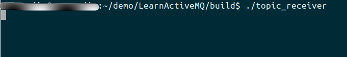
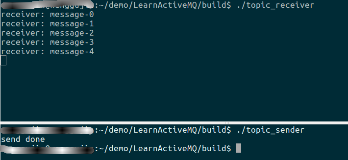

# 前言

上一篇我们学习了`队列`的基本使用方式，今天我们继续来学习一下基于`主题`的开发方式。类似与上一篇文章，我们仍然使用生产者/消费者的模式来进行学习。生产者创建一个主题，并向该主题发送消息； 消费者订阅该主题，但有人向这个主题发送消息时，所有订阅了该主题的消费者，都会收到消息。同样，一个订阅者可以订阅多个主题。

# 实战

## 生产者端的核心代码
```cpp
activemq::library::ActiveMQCPP::initializeLibrary();
cms::Connection* connection{nullptr};
cms::Session* session{nullptr};
cms::Topic* topic{nullptr};
cms::MessageProducer* producer{nullptr};
int num_messages{5};
std::string broker_url{"tcp://127.0.0.1:61616"};
std::string topic_name{"test_topic"};

try{
	activemq::core::ActiveMQConnectionFactory acf{broker_url};
	connection = acf.createConnection();
	connection->start();
	
	session = connection->createSession(cms::Session::AUTO_ACKNOWLEDGE);
	topic = session->createTopic(topic_name);
	producer = session->createProducer(topic);
	for(int i{0}; i < num_messages; ++i){
		std::unique_ptr<cms::TextMessage> msg{session->createTextMessage("message-" + std::to_string(i))};
		producer->send(msg.get());
	}
	std::cout << "send done" << std::endl;
	
	if(topic != nullptr){
		delete topic;
		topic = nullptr;
	}
	if(producer != nullptr){
		delete producer;
		producer = nullptr;
	}
	if(session != nullptr){
		session->close();
		delete session;
		session = nullptr;
	}
	if(connection != nullptr){
		connection->close();
		delete connection;
		connection = nullptr;
	}
}catch(cms::CMSException& e){
	e.printStackTrace();
}

activemq::library::ActiveMQCPP::shutdownLibrary();
```

## 消费者端的核心代码
```cpp
activemq::library::ActiveMQCPP::initializeLibrary();
	
cms::Connection* connection{nullptr};
cms::Session* session{nullptr};
cms::Topic* topic{nullptr};
cms::MessageConsumer* consumer{nullptr};
std::string broker_url{"tcp://127.0.0.1:61616"};
std::string topic_name{"test_topic"};

try{
	activemq::core::ActiveMQConnectionFactory acf{broker_url}; 
	connection = acf.createConnection();
	connection->start();
	
	session = connection->createSession(cms::Session::AUTO_ACKNOWLEDGE);
	topic = session->createTopic(topic_name);
	consumer = session->createConsumer(topic);
	
	while(true){
		cms::Message* message{consumer->receive()};
		if(message != nullptr){
			cms::TextMessage* msg{dynamic_cast<cms::TextMessage*>(message)};
			if(msg != nullptr){
				std::cout << "receiver: " << msg->getText() << std::endl;
			}else{
				std::cout << "not a text message" << std::endl;
			}
		}else{
			break;
		}
		delete message;
	}
	
	if(topic != nullptr){
		delete topic;
		topic = nullptr;
	}
	if(consumer != nullptr){
		delete consumer;
		consumer = nullptr;
	}
	if(session != nullptr){
		session->close();
		delete session;
		session = nullptr;
	}
	if(connection != nullptr){
		connection->close();
		delete connection;
		connection = nullptr;
	}
}catch(cms::CMSException& e){
	e.printStackTrace();
}

activemq::library::ActiveMQCPP::shutdownLibrary();
```

可见，对于`主题`来说，其开发方式与`队列`类似，只是把`createQueue()` 替换为 `createTopic()` 即可。

# 测试

编译上述代码后，会在`build`目录生成`sender`和`receiver`。

1. 启动第一个终端，启动`ActiveMQ`。方法参见上一篇文章。
2. 启动第二个终端，进入`build`目录，运行`sender`，向主题发送几条消息。之后，可以查看web终端，如下：


可见，我们成功向主题`test_topic`发送了5条消息。

3. 启动第三个终端，进入`build`目录，运行`receiver`，从主题中接收消息。运行结果如下：



意外的是，我们的接收端并没有收到发布者所发布的消息，并且web端也显示了我们的订阅者当前是成功的连接到了ActiveMQ。

这里的原因就是，对于主题消息来说，如果该主题当前没有订阅者在线或没有订阅该主题的持久订阅者，那么，发布者发布的消息就会成为一条废消息，不会推送给后续的任何订阅者。官网的说明如下：

> When you publish a message it goes to all the subscribers who are interested - so zero to many subscribers will receive a copy of the message. <font color='red'>Only subscribers who had an active subscription at the time the broker receives the message will get a copy of the message.</font>

所以，此处，如果我们想看到正常的现象，最简单的修改方式就是先启动我们的`receiver`，对主题进行订阅，等待消息的到来；然后，再启动`sender`发布消息即可。运行结果如下：



终于，我们看到接收端成功收到了发布者在该主题上发布的消息。

# 后记

对于`Topic`的消费者，同样可以使用上篇文章提到的另外几种消费方式。大家可以自行测试。

本文的详细代码见[lesson2](www.baidu.com)