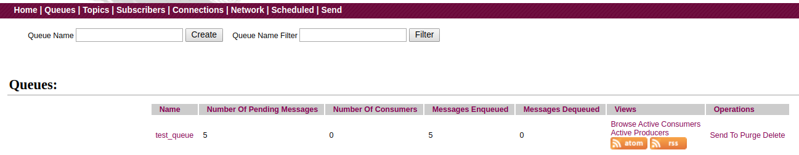
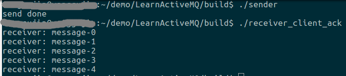
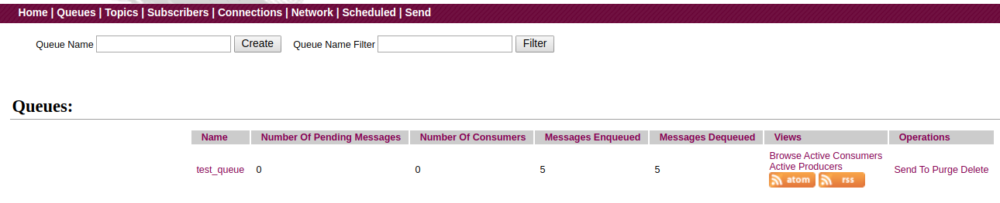
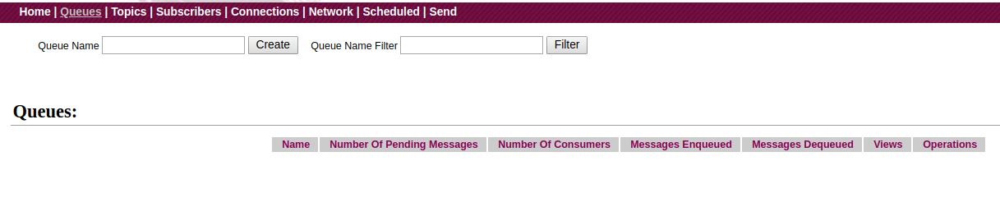
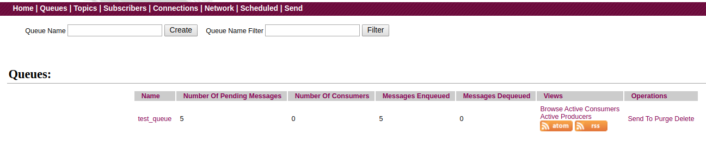
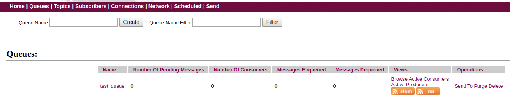
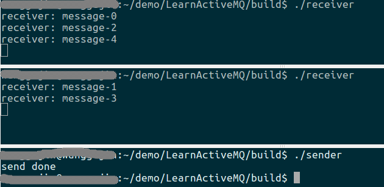
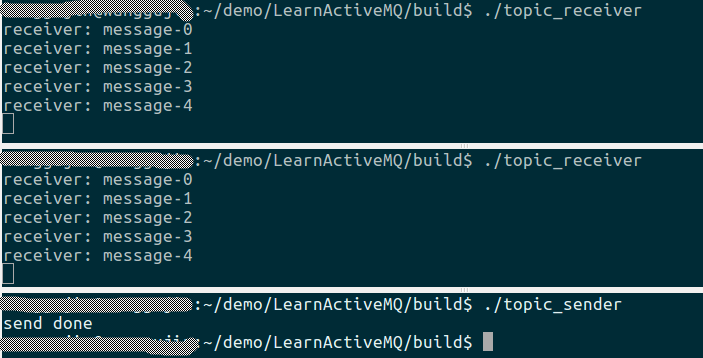

# 前言
 
 通过前面几篇文章，我们讲解了ActiveMQ的基本概念、`Queue`的使用方式、`Topic`的使用方式、持久订阅等等。这其中还有几个小的知识点没有提到，包括确认机制、事物机制、多消费者。

 # 确认机制

 在之前的代码中，不管是`Queue`，还是`Topic`，不管是生产者，还是消费者，在创建`session`时，我们使用的都是自动确认机制。代码如下：
 ```cpp
 session = connection->createSession(cms::Session::AUTO_ACKNOWLEDGE);
 ```

 其中，`AUTO_ACKNOWLEDGE`是`AcknowledgeMode`的枚举成员之一。该枚举类的定义如下：

 ```cpp
 enum AcknowledgeMode {
  AUTO_ACKNOWLEDGE,
  DUPS_OK_ACKNOWLEDGE,
  CLIENT_ACKNOWLEDGE,
  SESSION_TRANSACTED,
  INDIVIDUAL_ACKNOWLEDGE
};
 ```

 每一种确认机制的简单解释如下：

 - AUTO_ACKNOWLEDGE 当调用接收消息的函数成功返回，或者当消息监听器被成功被调用时，当前会话会自动向ActiveMQ确认该条消息已成功处理，ActiveMQ(Broker)将从缓存中删除该条消息。

 - DUPS_OK_ACKNOWLEDGE 自动批量确认，类似与`AUTO_ACKNOWLEDGE`，但具有批量和延迟确认的作用。即允许ActiveMQ在收到或发出一定数量的消息后，自动对消息进行确认。这种确认机制的一个副作用是可能导致消息的重复消费，即当消费者宕机重启后，那些在宕机前没有确认的消息会被重新投递给消费者。所以，该选项只适用与能处理重复消息的客户端或允许消息重复的项目。

 - CLIENT_ACKNOWLEDGE 要求消费者或生产者端手动的对消息进行确认。

 - SESSION_TRANSACTED 事物提交即确认机制。ActiveMQ支持事物机制，即消费到一条消息后，如果对该消息的处理失败了，可以执行回滚操作。

 - INDIVIDUAL_ACKNOWLEDGE 仅仅确认当前消息。默认情况下，当我们向ActiveMQ发送一条消息确认时，意味着当前消息及该消息之前的消息都被成功处理了，使用这种确认机制，允许我们只对当前消息进行确认，以避免并行处理时对消息的误确认。

 > 实际项目中主要使用`AUTO_ACKNOWLEDGE`、`CLIENT_ACKNOWLEDGE`、`SESSION_TRANSACTED`

 其中，`AUTO_ACKNOWLEDGE`，在之前的代码中一直在使用，至于效果吗，大家可以自行体会。下面我们着重来看一下手动确认`CLIENT_ACKNOWLEDGE`。此处，我们以基于`Queue`的生产者/消费者为例来讲解。

 # 消费者端的手动确认

核心代码如下：

```cpp
activemq::core::ActiveMQConnectionFactory acf{broker_url}; 
connection = acf.createConnection();
connection->start();
session = connection->createSession(cms::Session::CLIENT_ACKNOWLEDGE);
queue = session->createQueue(queue_name);
consumer = session->createConsumer(queue);
while(true){
  cms::Message* msg{consumer->receive(3000)};
  if(msg != nullptr){
    cms::TextMessage* text_msg{dynamic_cast<cms::TextMessage*>(msg)};
    if(text_msg != nullptr){
      std::cout << "receiver: " << text_msg->getText() << std::endl;
    }else{
      std::cout << "not a text message" << std::endl;
    }
		msg->acknowledge();
    delete msg;
  }else{
    break;
  }
}
```

上述代码和第一篇文章中的生产者/消费者的区别在于：

1. 创建会话时传递了`cms::Session::CLIENT_ACKNOWLEDGE`标志，代表开启该会话的手动确认机制。
2. 每处理完一条消息后，要手动的对消息调用一次`acknowledge()`方法，以此向ActiveMQ确认，消息以成功接收。

编译后会在`build`目录下生成`receiver_client_ack`程序。

测试方法如下：

1. 使用第一篇文章中的生产者程序`sender`向队里中生成几条消息。
2. 启动`receiver_client_ack`程序。

效果如下图：

消费前：



消费消息：



消费后：



可见，我们成功的消费到了队列中的消息，并且成功的向队列发出了确认，消息已全部被删除。

那么，问题来了，如果我注释掉上述代码中的`msg->acknowledge();`，也就是说，我们消费到消息后，不向ActiveMQ进行确认(签收), 会发生什么现象呢？我们来试一下：

消费前：


消费消息：


消费后：


可以看到，我们仍然能正确消费到队列中的消息，但由于我们没有给出确认，所以ActiveMQ并不会从队列中删除这写已投递的消息。如果我们再次启动`receiver_client_ack`，我们依然能消费到这5条消息，这就是所谓的`重复消费`了。

上面测试的是，注释掉`msg->acknowledge();`，那如果我们没有对每一条消息进行确认，而是接收到一批消息后，发起一次确认， 会如何呢？比如，修改代码如下：

```cpp
int count{0};
while(true){
  cms::Message* msg{consumer->receive(3000)};
  if(msg != nullptr){
    cms::TextMessage* text_msg{dynamic_cast<cms::TextMessage*>(msg)};
    if(text_msg != nullptr){
      std::cout << "receiver: " << text_msg->getText() << std::endl;
    }else{
      std::cout << "not a text message" << std::endl;
    }
    
    count++;
    if(count % 5 == 0){
      msg->acknowledge();
    }
    
    delete msg;
  }else{
    break;
  }
}
```

> 这里仅仅为了测试，因为我的发送端就是发送5条消息，所以此处对5取余。

这样一来，当程序运行结束后，队列中的消息是全部被消费呢？还是只被消费了一条？

编译程序，会在build目录生成`receiver_client_once_ack`程序。

测试如下：

消费前


消费后：


可见，这也证明了我们上面所说的理论，即默认情况下，一次ack会确认当前消息及之前的所以为确认的消息。

再进一步，如果我们将创建会话的标志改为`INDIVIDUAL_ACKNOWLEDGE`，再次运行程序会如何呢？这时你会发现，只有一条消息被成功消息，队列中会剩余4条待消费的消息。这个留给大家自行测试啦(手动滑稽)。

# 生产者端的手动确认

上面说了消费者端的手动确认是通过`CLIENT_ACKNOWLEDGE`标志来实现的，而消费者端的手动确认则是通过事物机制`SESSION_TRANSACTED` 来实现的。核心代码如下：

```cpp
activemq::core::ActiveMQConnectionFactory acf{broker_url};
connection = acf.createConnection();
connection->start();

session = connection->createSession(cms::Session::SESSION_TRANSACTED);
queue = session->createQueue(queue_name);
producer = session->createProducer(queue);
for(int i{0}; i < num_messages; ++i){
  cms::TextMessage* msg{session->createTextMessage("message-" + std::to_string(i))};
  producer->send(msg);
  delete msg;
}
session->commit();
std::cout << "send done" << std::endl;
```

编译后会在`build`目录生成`sender_client_ack`程序。测试效果如下：

发送消息前：



发送消息后：



可见，我们使用手动提交的方式也能成功的发送消息到ActiveMQ。

同样的问题，如果我们发送消息后，不进行提交，会怎么样呢？接下来，我们注释掉`session->commit()`这行代码，再测试看看。

发送消息前：


发送消息后：



可见，由于没有进行事物提交，内存中的消息并没有真正发给ActiveMQ。

> 注意，我们这里出于简单，是在发送完所有消息后，统一提交的，如果消息量很大，这会导致内存占用及宕机导致的消息丢失。实际情况中，可以对每一条发出的消息进行一次提交。

# 多消费者

之前的例子中，我们只演示了单个生产者/单个消费者的情况，那如果有多个消费者会怎么样呢？

- 对于点对点模式，一个队列如果有多个消费者，则ActiveMQ会将队列中的消息轮训的投递给每个消费者。即一条消息只能被一条消费者消费。

我们可以使用第一篇文章的生产者/消费者来测试这个结论。

1. 先启动两个消费者实例，等待消息到来。
2. 启动生产者，向队列中发布5条消息，观察两个消费者打印出的消息编号。

测试结果如下：



可见，点对点模式下，多个消费者轮流消费消息，且不会出现多个消费者消费到同一条消息的情况。

- 对于发布订阅模式，每条消息可以被多个消费者消费到。所以，如果当前有多个消费者在线的话，发布者发布一条消息，每一个订阅者都会接收到这条消息。

同样，我们可以使用第二篇文章中的基于主题的发布者/订阅者程序来进行验证。

1. 先启动两个订阅者，对同一个主题进行订阅。
2. 启动发布者，向该主题发布5条消息，观察每个订阅者的打印情况。

测试结果如下：



每个订阅者均收到了发布者发出的所有消息。

> 本文详细代码见[lesson4](https://github.com/wanggujin/LearnActiveMQ/tree/master/lesson4)
